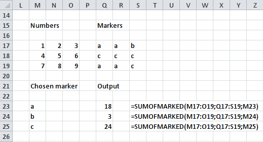

# Utilities for sets
*A collection of simple functions for sets of data*

### Functions
Currently, following functions are implemented in this module:
 - SUMOFMULT
 - SUMOFMULT2
 - SUMOFDIV2
 - SUMOFMARKED
 - AVERAGEOFMARKED
 
### Usage

#### SUMOFMULT
This function takes multiple identical-sized ranges as an input and calculates sum of multiplications of *i*th row and *j*th column cell of each range:


Example cell input:
```
=SUMOFMULT(A1:B2;C1:D2;E1:F2)
```

#### SUMOFMULT2
This function works as SUMOFMULT for _exactly two_ identical ranges.

#### SUMOFDIV2
This function calculates the sum of a<sub>ij</sub> / b<sub>ij</sub> division results. 


Example cell input:
```
=SUMOFDIV2(A1:B2;C1:D2)
```

#### SUMOFMARKED
This function takes as an input two ranges: first one with numbers, second one with markers (both of identical size). Third input parameter is chosen marker. Output is the sum of numbers, which corresponding markers are the same as a chosen marker.



Markers can be any of type (text, number, etc.).

#### AVERAGEOFMARKED
This function works as SUMOFMARKED, but instead of sum, it calculates the average of marked numbers.

